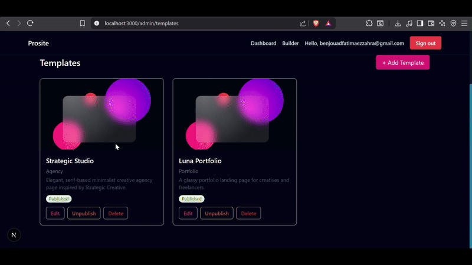

# Prosite is an AI-Powered Website Builder & Hosting Platform
Think of it as WIX.com 

**Prosite** is a modern SaaS platform that empowers freelancers, agencies, and small businesses to **create, customize, and host professional websites** — all in a few clicks.

It’s built with **Next.js 15**, **TypeScript**, **Tailwind CSS**, **MongoDB**, and **Stripe**, featuring a clean Builder UI, live previews, SEO automation, and managed hosting.

NOTE: I'm still in the production process :)) not yet finished

## 🚀 Features

### 🧩 Website Builder
- Pick from professional **templates** (portfolio, restaurant, agency, blog, etc.)
- Customize **theme colors, fonts, and content**
- Live **responsive preview** (desktop/tablet/mobile)
- Automatic **theme saving** and **content sync** via MongoDB

### 💳 Checkout & Plans
- Integrated **Stripe Checkout** :Basic, Standard, Premium
- Monthly / yearly billing cycles
- Real-time plan activation and website deployment

### 🌐 Hosting & Deployment
- Generates static websites and deploys to **Cloudflare Pages** or **S3/R2**
- Auto-subdomain creation and SSL via Cloudflare
- Admin dashboard for template uploads and redeploys

### 🤖 SEO Automation (Next Phase)
- AI agent that crawls, audits, and optimizes sites
- Auto-generated meta tags, sitemaps, OG images, and keyword insights

### 🔒 Authentication & Dashboard
- User login with **NextAuth**
- Secure session management
- Manage websites, billing, and templates in one place

---

## 🛠️ Tech Stack

| Layer | Technology |
|-------|-------------|
| Frontend | Next.js 15, React, TypeScript, Tailwind CSS |
| State Management | Zustand |
| Backend | Next.js API Routes, MongoDB |
| Auth | NextAuth.js |
| Payments | Stripe Checkout |
| Storage | Cloudflare R2 / S3 |
| Deployment | Vercel or Cloudflare Pages |
| SEO Automation | LangGraph / OpenAI (Not built yet) |
